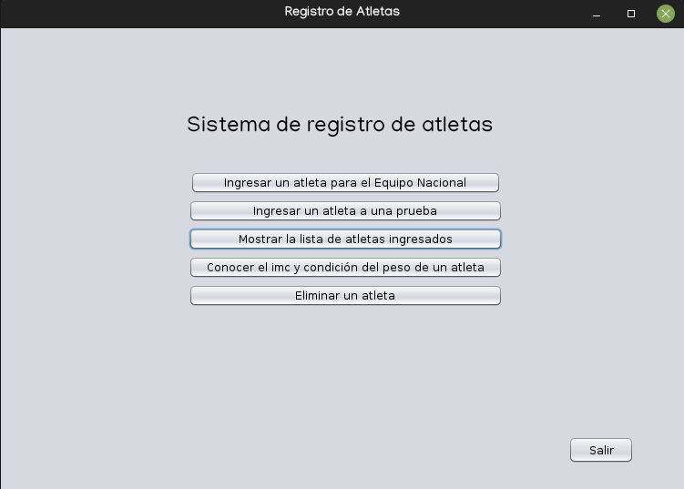
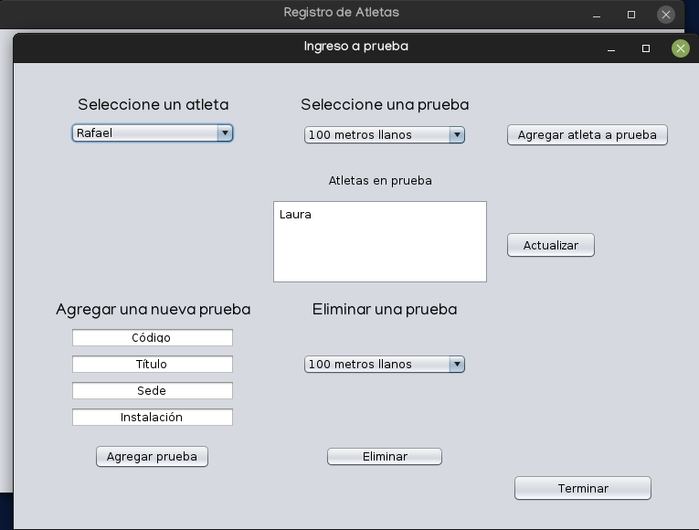
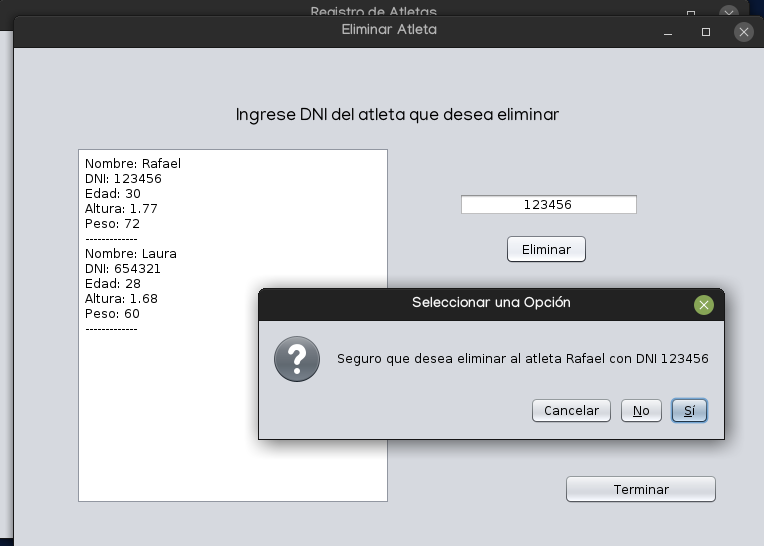

# Sistema de registro de atletas

## Software para registro de atletas en competencia.

### Funcionamiento

A partir del menú principal se pueden seleccionar diversas opciones para realizar la gestión completa de la competencia como el ingreso de los datos de atleta y asignación al equipo, consultas de índice de masa corporal, creación de pruebas y asignación de los atletas a las mismas entre otras.

### Capturas

*Menú principal*

*Ingreso de atletas a pruebas de la competencia*

*Pantalla para eliminar un atleta del registro*

### Tecnologías

El programa está íntegramente escrito en Java siguiendo el diseño MVC y hace uso de Swing, AWT y persistencia a través de stream de datos.
